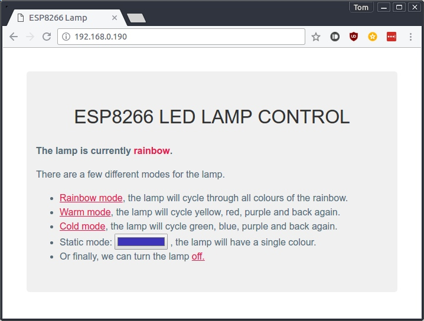

# LED Smart Lamp

## Design

The lamp has a wooden base made of hardboard and pine, stained dark and finished with a matte varnish. The the rest of the lamp is made of frosted acrylic squares, glued together to make a cube, which sits on top of the base. 

The electronics sit in the base of the lamp, with the exception of the LEDs which sit on a black piece of card that lies on top of the wooden base.

## Electronics

~~The circuit diagram for the lamp is below. A NodeMCU is used because~~
~~a) I had one available~~
~~b) The pins are 5V tolerant, needed for the NeoPixels~~

A Wemos D1 Mini Pro has now replaced the NodeMCU. The main reason for this change is that the Wemos device is much cheaper and smaller than the the NodeMCU. The diagram below has not changed.

## Lamp modes
1. Rainbow mode
   This mode cycles through the available spectrum of colours continuously.
2. Static mode
   This mode sets a single static colour for the lamp.
3. Warm mode
   Same as rainbow mode, but only yellows, red and purples.
4. Cold mode
   Same as rainbow mode, but only greens, blues and purples.
5. Off
   Sets the LED colour to rgb(0, 0, 0), which turns the LEDs off.

## Web Interface

The lamp is controlled by a webpage hosted on the esp8266 directly.  From this interface the lamp can be set to any of the modes.  
